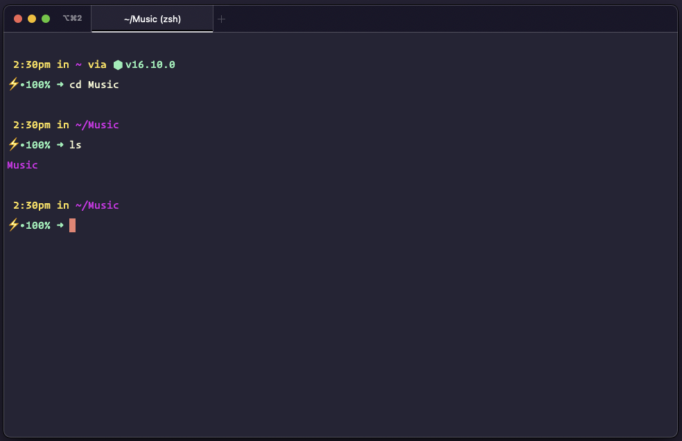

# Material Synthwave iTerm Color Scheme

Here is an [iTerm Color Scheme](https://iterm2.com/documentation-preferences-profiles-colors.html) based on my [Material Synthwave VSCode theme](https://github.com/nexxai/material-synthwave-vscode) "a very simple and probably visually not-so-great mash-up of Robb Owen's SynthWave '84 window coloring and equinusocio's Material Theme font colorings."

  <a href="https://github.com/nexxai/material-synthwave-iterm/raw/main/material-synthwave.zip" class="button">
    Download Theme
  </a>

## Installation

Download the zip file below, unzip the file, and then in iTerm2, do `iTerm2 > Preferences > Profiles > Other Actions > Import JSON Profiles` and select the JSON file.

This theme makes use of Hoefler & Co's [Operator Mono](https://www.typography.com/blog/introducing-operator) font.

## Preview

  <a href="https://github.com/nexxai/material-synthwave-iterm/raw/main/material-synthwave.zip" class="button">
    Download Theme
  </a>

## Suggested configuration

* Using the iTerm Minimal theme: `iTerm2 > Preferences > Appearance > General > Theme: Minimal`
* Always show tab bar: `iTerm2 > Preferences > Appearance > Tabs > Show tab bar even when there is only one tab` 

## Inspiration

### VS Code Theme

